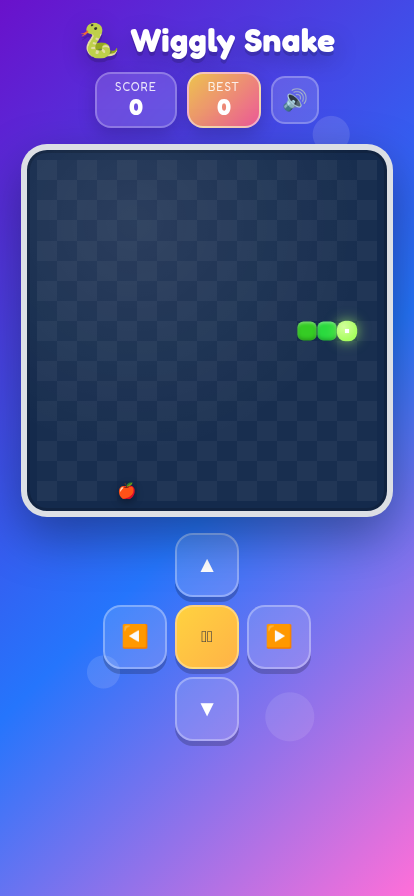

# 🐍 Wiggly Snake — a C# Snake game

A colorful, kid-friendly Snake game built with **C#** and **Blazor WebAssembly**.
Guide the snake around the board to munch fruit, grow longer, and beat your high
score. Designed to be fun for kids and enjoyable for everyone.



## ✨ Features

- **Written in C#** — game logic runs in the browser via Blazor WebAssembly (no JavaScript game engine).
- **Touch controls** — swipe anywhere on the board to steer, plus large on-screen arrow buttons for phones and tablets.
- **Keyboard controls** — arrow keys / WASD on desktop.
- **Playful UI** — bright gradients, a smiley glowing snake, bouncy fruit, score + best-score tracking.
- **Sound effects** — a cheerful chirp when the snake eats food and a game-over sound when it dies (Web Audio, generated at runtime — no audio files needed).
- **Sound toggle** — mute/unmute button.
- **Responsive** — scales cleanly from phone to desktop.

## 🎮 How to play

1. Press **Play**.
2. Steer the snake with:
   - **Swipe** on the board (touch devices)
   - **On-screen arrows**
   - **Arrow keys** or **WASD** (keyboard)
3. Eat the fruit 🍎 to grow and score. Avoid running into the walls or yourself!

## 🛠️ Tech stack

- [.NET 8](https://dotnet.microsoft.com/) / **C#**
- [Blazor WebAssembly](https://learn.microsoft.com/aspnet/core/blazor/)
- Web Audio API for sound (invoked from C# via JS interop)

## 🚀 Run locally

You need the [.NET 8 SDK](https://dotnet.microsoft.com/download).

```bash
dotnet restore
dotnet run
```

Then open the URL printed in the console (e.g. `http://localhost:5000`).

## 📦 Build for production

```bash
dotnet publish -c Release
```

The static site is emitted to `bin/Release/net8.0/publish/wwwroot` and can be
hosted on any static host (GitHub Pages, Vercel, Netlify, etc.).

## 📁 Project structure

```
Program.cs            App entry point
Pages/Home.razor      Game component (all game logic in C#)
Layout/               App shell
wwwroot/
  css/app.css         Styling
  js/audio.js         Web Audio sound effects
  index.html          Host page
```

Enjoy! 🐍🍎
